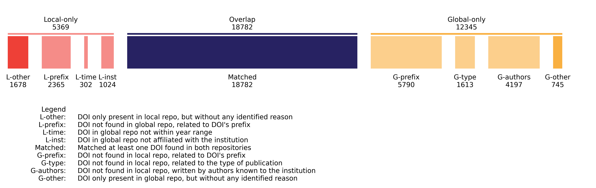

from source.RulesProcessor import AbstractRulefrom source.RulesProcessor import RuleProcessorfrom locale import locale_alias

# Local and Global Scientific Repositories Overlap Analysis

## Introduction
This code is used to analyze the overlap between local and global scientific repositories.
A local repository is a repository that is maintained by a specific institution (e.g., https://infoscience.epfl.ch/), while a global repository is a repository containing data from multiple institutions (e.g., https://openalex.org/).

The goal of this code is to take the following information as input:
- A list of DOIs from a local repository 
- The ROR ID of the institution that maintains the local repository
- The time period for which the overlap should be calculated

Once this information is provided, the code will:
- Automatically retrieve publication from a Global repository
- Measure the overlap and build three sets:
  - Local only publications (publication found only in the local repository)
  - Overlapping publications (publication found in both the local and global repository)
  - Global only publications (publication found only in the global repository)
- Produce a visualization of the overlap like the one shown below



Using this chart, we can quickly identify, for instance, that: 
 - 14.7% if papers from the local repository cannot be found in the global repo. 
 - That 2371 papers (L3) cannot be found in the global-repo because the prefix is not indexed in the global repo (master theses in this specific case).
 - ...

More details about this project in the following paper:
XXX

## Quick Start

### Installation

Clone the repository and install the required packages by running:
```bash
git clone
pip install -r requirements.txt
```

### Preparing the sets

The first step is to prepare the data. This step is required to retrieve the data from the global repository and compute the 3 sets (local only, overlapping, global only).

Minimal code to prepare the required input data and retrieve the data from the global repository:
```python
from source.OverlapProcessing import OverlapProcessing

# local_dois is a list of potentially multiple DOIs because a single publication might have multiple DOIs
local_dois = [['10.1109/RO-MAN53752.2022.9900775'], ['10.1016/j.carbpol.2023.120622'], ['10.5194/acp-21-17687-2021', '10.5194/acp-2021-488']]

# The year range used to extract the local dois
yr_min = 2019 
yr_max = 2023

# The ROR ID of the institution that maintains the local repository
ror_id = 'https://ror.org/02s376052'

# For now, the only option is 'openalex' but we plan to extend this to other global repositories such as OpenAIRE
global_repo_name = 'openalex'

# A folder where the retrieved data will be saved
# So that we can reuse the data without having to retrieve it again
path_export = 'exported_data/'

# Initialize the processor
# It might take several minutes for a large institution
processor = OverlapProcessing()
processor.prepare_repositories(local_dois, yr_min, yr_max, ror_id, global_repo_name, path_export)
```

### Load the sets

If you have already retrieved the data, you can load it from disk using the following code. By doing so, you avoid having to retrieve the data again.
```python
from source.OverlapProcessing import OverlapProcessing
processor = OverlapProcessing()
processor.load_repositories('epfl_openalex')
```

### Build the overlap chart

Once the processor is initialized, you can use the following code to generate the overlap chart.

To make the chart more readable, a publication is explained by a single rule in the bar chart. Hence, the order in which the rules are applied is important when building the chart.

```python
from source.OverlapProcessing import OverlapProcessing
processor = OverlapProcessing()
processor.load_repositories('epfl_openalex')

# Save the bar chart to a file
show_legend = True

# Define the order in which the rules are applied
local_order = ['L-inst', 'L-time', 'L-prefix', 'L-other']
matched_rule_order = ['Matched']
global_rule_order = ['G-prefix', 'G-type', 'G-authors', 'G-other']

processor.build_bar_chart(local_order, matched_rule_order, global_rule_order, 'example.svg', show_legend)
```

## Extensibility

### Adding a new global repository
The code is designed to be easily extensible. For instance, you can easily add a new global repository by creating a new class similar to OpenAlexRepository in [BaseObjects.py](source/BaseObjects.py) folder. 
All you need is to implement the methods: load_from_ror(), load_from_dois

### Adding a categorization rule
A rule allows providing a more detailed analysis of the overlap. Instead of just having a single value for the overlap, we categorized the overlap based on specific rules.
You can easily extend the categories by creating a new class that inherits from AbstractCategory in the [Categories.py](source/Categories.py).
For instance, the following code creates a new category that checks if one of the DOIs contains the letter "a" (silly example to get the idea):

```python
class L4(AbstractRule):
    code = 'L4'
    description = 'One of the DOI contains the letter "a"'
    color = '#f58c87'
    order = 4

    def __init__(self, local_only, overlap, global_only, global_repo_from_missing_doi):
        super().__init__(local_only, overlap, global_only, global_repo_from_missing_doi)

    def apply(self, publication):
        if 'a' in publication.DOIs:
            return True
        
        return False
```

Then, you need to register the new category in the CategorizationProcessor [Classification.py](source/Classification.py)[Categories.py](source/Categories.py) file:
```python
class LocalCategorizationProcessor(RuleProcessor):
    '''
    This class tries to explain the local only publications.
    The last category is the default category.
    '''
    def __init__(self, *args):
        super().__init__()
        self.categories = set([L1(*args), L2(*args), L3(*args), L4(*args), LocalDefault(*args)])
```

## Contact
For any questions, feel free to contact us (contact in the paper)